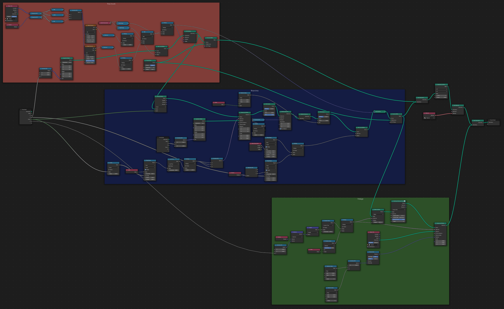
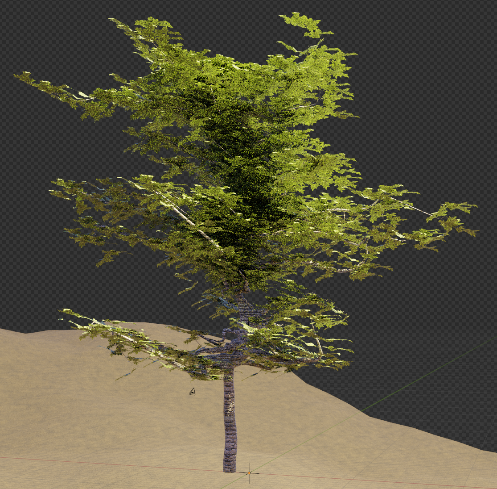
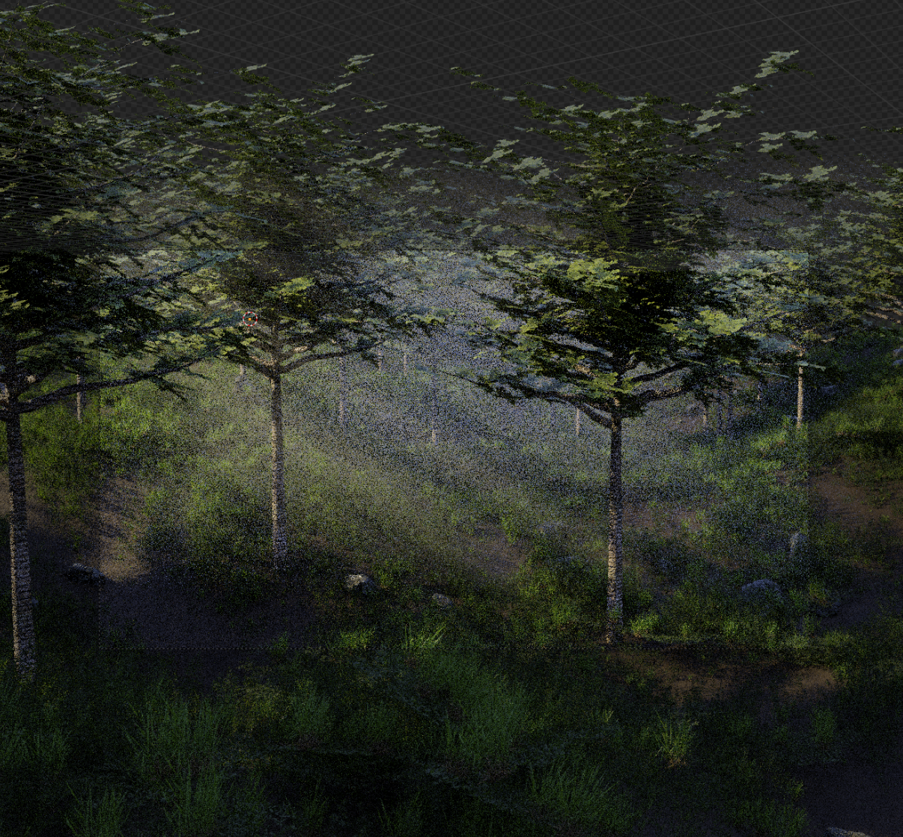
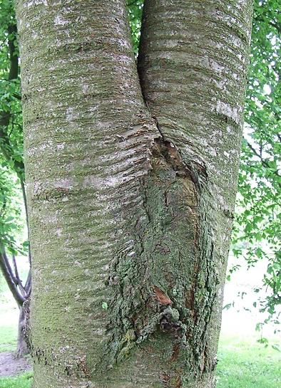

# Proceduell skogsmiljö

<!--  -->

En genererad och renderad bild.

## Inledning
Idén med det här projektet var att skapa en rik och realistisk skogsmiljö proceduellt dvs med så liten input från en människa som möjligt.

I scenen finns ett markplan, träd, olika typer av gräs, buskar och stenar. 

## Bakgrund
Naturen följer i grund och botten regler som definerar hur saker växer och fortplantas. Genom simplifiera dessa regler och skulle man kunna skapa geometri som liknar riktiga växter eller andra naturliga objekt. Genom att introducera olika typer av brus och slummässiga värden skulle man sen kunna i teorin generera ett oändligt antal unika träd och stenar etc. Fördelen med den här metoden är att till skillnad från att modelera alla objekt så skalar det nödvändiga arbetet väldigt bra för stora scener. Mängden repetion i scenen kan även minskas genom att inte återanvända samma resurs många gånger. Man kan också effektivisera eller komplisera geometrin i scenen enkelt i efterhand genom att bara modifiera parametrar kopplade till hur många polygoner som genereras, något som kan vara en tidskrävande uppgift om resurserna skulle vara traditionellt modellerade modeller.

3D programet Blender introducerade i februari 2021 Geometry Nodes vilket är ett set av noder som kan användas för att generera, modifiera eller ta bort geometri. Idéen med noderna är att man ska kunna skapa komplexa former proceduellt så att man enkelt ska kunna modifiera input parametrar. Noderna kan bland annat användas för att sprida ut instancer av ett annat objekt på det ursprungliga objektet. Något som är väldigt användbart för att sprida ut till exempel träd och stenar på ett markplan eller grenar på en trädstam.

## Implementation
Implementationen av scenen gjordes i programet Blender. 

### Markplanet

Eftersom Idéen var att skapa en skogscen behövde markplanet ha lite ojämnheter och en jordliknande yta.

Steg ett var att skapa ett plan som ursprungspunkt. Geometry Nodes kunde sedan användas för att introducera brus som position förskjutning i z-led.

`Set Position` noden i bilden ovan tar in olika värden från fractal perlin noise texturen till vänster och förvränger såldes ytan. Geomtrin från ytan kan sedan pasera vidare till andra geometri noder för att generara resten av scenens objekt. Innan geomtrin går till utgången finns en `Set Material` nod som ger marken rätt material.

För att ge marken en mer jordlik yta användes högfrekventbrus som en bump map vilket ger materialet en jordig/sandig yta. Materialets glasighet sattes sedan till noll för att ge ytan ett grumligt diffust utseende.

### Träd

Under arbetets gång testades tre olika metoder för att generera unika träd. Första metoden som testades var att generera träd genom att repetera en trädstam i olika slumpmässigt valda riktningar samtidigt som storleken på stammen skalas ner.

På bilden finns träd genererade med den metoden men utan löv för att bättre illustrera trädets struktur. Denna metod ser okej ut från avstånd men så snart man observerar trädet på närmare avstånd blir det tydligt att den består av raka stammar. Detta försökte jag lösa genom att vrida och distordera stammarna men då var det istället svårt att passa ihop dem och undvika skarpa kanter utan att få extremt mycket polygoner. Det andra problemet med den här metoden var att det är väldigt svårt att få realistiska former i förgreningspunkterna. Det blir lätt glipor och andra artifakter. Slutligen så genererar metoden ganska dålig typologi eftersom många bitar genomskär varandra vilket leder till suboptimal prestanda och svårigheter i textureringsprocessen. Det blev därmed tydligt att jag behövde hitta en annan metod.

Metod två var att modellera ett träd på klassiskt vis och sen använda brus för att distordera trädet till olika former. Problemen med denna metod var att distorderingen gjorde att stammen kunde flytta på sig i någon riktining vilket gjorde att den inte alltid stod på marken. Sen blev distoreringen på grenarna väldigt ful eftersom den lätt gjorde att tjockleken på grenen varierade på ett onaturligt sätt. Lite likt hur en damsugarslang blir när man klämmer den. Anledningen till detta är eftersom det bara sitter polygoner i endpunkterna på varje rak sträcka på grenarna vilket men bruset vill vrida den där det inte finns polygoner. Sista problemet med denna metod var att den gav lite möjligheter för variation. Även om instansernas grenar gick lite i olika riktning så hade de alla träden ungefär samma storlek och exakt lika många grenar.

En annan metod behövde hittas som skulle ge hög kvalitet och bra typologi på nära avständ och samtidigt ge mycket flexibilitet i genereringen. Jag började då experimentera med att använda profilkurvor. Dvs profiler som tex en cirkel som sedan följer bezierkurvor för att skapa en form. Först togs en stam till trädet fram genom att skapa en kurva i z-led vars radius minskade linjärt längs längden och sedan distordera den med brus.

Resultatet av det syns i bilden ovan. Antalet polygoner kan nu enkelt varieras genom att skjustera input parametern till noden som skapar cirkeln som följer kurvan. Nästa steg var att skapa grenar från stammen. Genom att plocka slummässigt distruberade punkter på stamkurvan kunde förgreningspunkter väljas. De som var för långt ner kunde sedan maskas ut genom att kolla om deras z värde var över en viss definerad nivå. Genom att sätta den nivån till 1 kan man då göra så stammen alltid är utan grenar första metern.

Geometrinoderna i blåa rutan i bilden ovan koresponderar alla till skapandet av grenarna. Genom att använda indexet för varje gren kan varje gren förkjutas 135° från föregående gren för att skapa en väldigt realistisk fördelning. Detta visade sig ge väldigt trovärdiga resultat. Att använda en helt slumpmässig vinkel funkade också men tenderade att skapa för kaotiska träd som därmed inte så lika verkliga ut. Inställningar som antalet grenar, trädets höjd och grenarnas längd kan alla skjusteras som input parametrar till objektet.

Varje gren kan sedan slumpmässigt trimmas till en viss längd för att skapa en mer intressant trädform. Slutligen sätts start radien på varje gren utifrån z-postionen av grenens rot för att sedan linjärt avta till 0.

Med det färdigt ser resultatet ut som bilden ovan. Slutligen behövde trädet löv.

Ursprungligen hade trädet individuella löv men det blev snabbt tydligt att det skulle bli alldeless för krävande för en en hel skog. Lösningen var att skapa en enkel mesh på en hel gren med transparent textur för att skapa den komplexa formen med väldigt få polygoner. Genom att böja objektet i lite olika riktningar kunde det dölja faktumet att grenen bara är en platt bild vilket när det är många grenar ger ett väldigt trovärdigt utseende. Nackdelen med denna metod är dock att varje gren är identisk på nära avstånd. Man måste dock kolla väldigt nära för att märka detta. Det bästa skulle självklart vara att generera alla grenar och bara sätta på löv men detta var inte ett alternativ som nämnt innan av prestandaanledning. En lösning på detta skulle kunna vara att ta fram en samling av olika bilder och variera dessa i distruberingen dock känndes det inte nödvändigt för detta ändamål.

Löven kunde sedan distruberas på trädets grener med en liknande metod som när grenarna distruberades på stammen. Alla grenar distruberas plant i xy-led med lite slumpmässig vinkel eftersom löv på ett träd lägger sig vinkelrätt mot solen. Ett problem som uppstod var dock att det såg orealistiskt ut att det placerades löv nära första förgreningspunkten på stammen. På riktiga träd blir det sällan löv där eftersom väldigt lite ljus når dit. Lösningen var att begränsa placeringen av löv till att endast placera dem om distansen till trädets root var över ett visst värde. Detta gör att trädets löv blir glesara nära stammen vid första förgreningspunkten med en mask som har formen av en sfär från rooten vilket kan observeras i bilden ovan. Metoden fungerar och ger relativt verklig distrubering av löv men en vidareuveckling skulle kunna vara att göra masken mer oval så att löven undviker stammen även högre upp på trädet på långa träd så som i bilden ovan.

Resultatet är slutligen nodeträdet i bilden ovan. Trädet består av tre distinkta delar, stammen (röd), grenarna (blå) och slutligen löven (grön). Den ensamma noden till vänster är input noden som skickar in alla parametrar som man som användare kan skicka in.

Här ovan är ett träd genererat med de parametrar som användes för de slutliga renderingarna.

Här ovan är en skog genererad med parametrar som gör träden yngre och mindre.

### Stenar

Skogen behövde stenar för att ge scenen mer realism. Stenarna skapades även dem proceduellt. 

Först appliserades en subdivide nod på en kub för att skapa fler polygoner. Sedan kunde voroni brus användas för att distordera kuben till slumpmässiga stenformer. I gifen ovan är ett exempel på olika styrkevärden på voroni bruset. När sedan ett stenmaterial appliserades gav det en väldigt trovärdig sten. Stenar visade sig väldigt enkla att skapa i jämförelse med träden eftersom de kan se ut ungefär hursomhelst och har en väldigt enkel sammanhängande form bestående av endast ett material.

### Gräs och Buskar
Slutligen behövde gräs och buskar skapas. Dessa skulle kunna skapas på exakt samma sätt som trädet med bezierkurvor som extruderas med en cirkel och sen sätts på löv på. Dock eftersom jag spenderat så mycket tid på att skapa de olika träden fanns det inte tid nog att skapa geomtrinoder till alla dessa objekt också. Istället Valde jag att skapa en kollektion med traditionellt modellerade gräsplättar, burskar och grästovor. Dessa kunde sedan distruberas ut med hjälp av gemotrinoder.

Geometrinoderna på markplanet kunde därmed utökas med distruberingen av stenar, gräs och buskar. Där avsaknaden är dessa visar den nakna marken med jordmaterialet från tidigare. I bilden ovan representerar noderna i den bruna rutan markplanets skapande som förklarat i sektionen markplanet. Den gråa och gröna tillagda rutorna motsvarar fördlningen av stenar och gräs och dylikt respektive. Alla de föremålen är fördelade med hjälp av fractal perlin noise.

### Slutgiltig komposition

Slutligen kunde träden läggas in. Dessa laddes till på liknande sätt som stenarna och gräset men för att göra distruberingen av träden mer intressant så skapades en mask för bara placera träd där marken var låg. På så sätt blir träden mer distruberade som små skogsdungar och om man skulle vidareutveckla modellen skulle man enkelt kunna skapa berg där det inte instanseras träd.

### Rendering

För att skapa fina renderingar lades en area light in i scenen samt en stor volym för att ge scenen mer djup och en lite disig mystisk känsla. En enviroment map med en skogscen i solnedgång lades också till för att ge mer naturligt ljus och färgskiftning på objekten i scenen. Eftersom enviroment mappen var ganska kall så valdes en väldigt varm ton till lampan i scenen.

## Resultat

## Intressanta problem

Det absolut största problemet under projektets gång var prestandan i blender vid navigeringen och manipulering av scenen. Detta ledde till att jag under större delen av arbetet var tvungen att arbeta med alla objekt på marken och helst även träden avstängda. Detta gjorde förbättringsarbetet av scenen väldigt svårt. Trots det har inte scenen överdrivet många polygoner men det verkar tyvärr som att blenders prestanda helt enkelt blir väldigt negativt påverkad av de proceduella noderna. Lösningen är att baka alla noder och distrubitioner men då förlorar man hela poängen med projektet vilket är att hålla scenen så modifierbar och proceduell som möjligt. Ett annat problem är att gemotrinoderna är väldigt nya och och därför ganska begränsade. Under arbetets gång körde jag Blender 3.1 alpha vilket är en alpha version av en release som inte kommer släppas förs än i mitten av mars. Anledningen till detta är att den versionen lägger till flera nya nödvändiga noder samt flera prestanda förbättringar för arbete med geometry nodes. Dock eftersom det var en alpha blev det väldigt många crashar under arbetets gång.

Ett annat problem som visade sig under arbetetsgång var hur svårt det var att få fina mjuka övergångar i förgreningarna på träden. Det blir lätt hårda spetsar där och framförallt situationer där grenen som skjuter ut skapar en glipa från platsen där den startar. Ideallt hade man viljat extrudera den nya grenen ur huvudgrenen så att de är samma mesh så man sen skulle kunna använda en subdivision surface modifier för att få snygga förgreningar. Dock ser jag inget sätt att göra sånna mer avancerade operationer med gemetry nodes idag men detta kanske skulle vara möjligt i framtiden om det introducerade en ny nod som kan sätta ihop två meshes till en. Idag finns en liknande nod som lägger ihop meshes men problemet är att de mer eller mindre gruperas bara och de blir fortfarande behandlade som separata objekt när man sen lägger på andra noder. Metoden med att använda kurvor och cirklar längs kurvorna funkar relativt bra och är definitivt mycket mer realistisk än första metoden där jag placerade ut raka stammar. Men om man vill skapa hyperrealistiska träd på nära avstånd är det fortfarande mycket detaljer som saknas speciellt hur förgreningen smälter ihop trädmaterialet i verkligenheten.

I bilden ovan finns ett exempel på hur en sådan förgrening kan se ut i verkligheten. Notera hur grenerna först är samansmälta och sen mer eller mindre växer ur varandra istället för att bara ta en kurva som forsätter och sen som startar i och växer ut. De är fundamentalt lika men blir inte lika mjuka övergångar som i verkligheten.

## Slutsats

Generellt känns det som att geometry nodes har en helt otrolig potential! Jag är speciellt nöjd med hur väl trädet slutligen blev. Metoden jag arbeta fram fungerade exceptionellt bra för att skapa ett realistiskt träd med väldigt bra typologi. I framtiden skulle modellen enkelt kunna expanderas för att likna olika trädtyper. Utöver det skulle man med hjälp av geometry nodes kunna mäta avståndet till kameran och därmed om det är tillräkligt långt bort förenkla trädet. Vid extremt stora scener skulle man även kunna byta ut trädet mot en billboard vid väldigt långa avstånd vilket då skulle tillåta användaren att skapa massiva skogar som både ser fantastiskt detaljerade ut där varje träd är unikt och har bra prestanda. Jag tror att vi kommer se en väldigt stor utvekling av nya geometry nodes och fler användningsområden inom de närmsta åren. Att kunna skapa scener och objekt proceduellt är ett extremt kraftfullt verktyg för att skapa unika realistiska objekt.

Nakdelen är dock att det tar lång tid att utforma ett komplext objekt som ett träd proceduellt och hade man modellerat på klassiskt vis hade det varit mycket enklare att i efterhand gå in och lägga till detlajer och modifiera trädets struktur. Ska man dock göra många unika träd så börjar poängen med proceduellt visa sig eftersom man då kan generera hur många unika träd man vill omedelbart. Jag tror därför att det finns olika användsningområden med båda metoderna.

Att använda noise på olika sätt har visat sig vara extremt kraftfullt. Både för att skapa unika förgreningar och riktningar på grenarna på träden, för att förvränga stenar eller för att placera ut instanser på en yta. Med hjälp av slumpmässiga värden kan även andra parametrar som antalet grenar på ett träd eller höjden på trädet varieras vilket skapar en rik mångfald i renderingarna.

## Referenser

https://wiki.blender.org/wiki/Reference/Release_Notes/2.92/Geometry_Nodes
